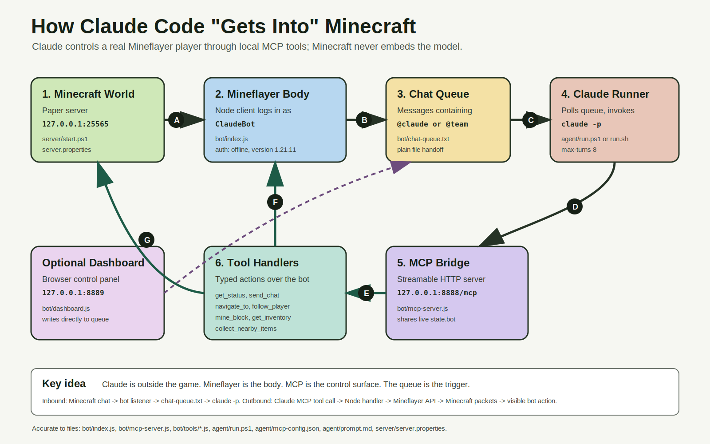

# Claude in Minecraft — Headless AI Agent

**Claude Code plays Minecraft.** ClaudeBot joins your private server as a real in-game character, listens to chat, and responds to natural-language commands by physically moving, mining, and exploring the world.

> **Inspired by:** [Why I Love Headless AI Agents: Minecraft & Swarms](https://www.youtube.com/watch?v=ena1W3_lWpc) — a demo showing Claude Code and Codex as playable Minecraft characters controlled entirely through headless CLI flags.

---

## Demo

[](https://PLACEHOLDER_DEMO_VIDEO_URL)

> *ClaudeBot receiving chat commands, pathfinding across the world, and replying in real time.*

---

## How it works

Claude never "sees" Minecraft. It reads a chat message (plain text) and calls typed tools (functions). Mineflayer translates those tool calls into actual game actions — movement, mining, chat. The intelligence (Claude) and the body (Mineflayer) are completely separate, connected by MCP.



```
You type "@claude follow me" in Minecraft chat
      ↓
Mineflayer bot receives the message → writes to chat-queue.txt
      ↓
Bash agent runner detects the file → invokes claude -p
      ↓
Claude calls MCP tools: get_status, follow_player, send_chat
      ↓
MCP server translates calls → Mineflayer bot actions
      ↓
ClaudeBot physically sprints toward you in the game world
```

The entire cycle takes **15–20 seconds** — one `claude -p` invocation per command, no persistent Claude process needed.

---

## What ClaudeBot can do

| Command | Action |
|---------|--------|
| `@claude follow me` | Pathfinds and continuously follows you |
| `@claude come to -6 64 152` | Navigates to coordinates |
| `@claude mine 5 oak_log` | Finds nearest logs, mines them, collects drops |
| `@claude what do you see` | Scans nearby blocks and entities, reports back |
| `@claude what's in your inventory` | Lists current inventory |
| `@claude stop` | Halts all movement |
| `@team explore for sheep` | Scans for passive mobs in range |

Commands work from **in-game chat** (press T) or the **web dashboard** at `http://127.0.0.1:8889`.

---

## Architecture highlights

- **No Minecraft mod or plugin.** ClaudeBot is a standard network client using Mineflayer — the Paper server sees it as a normal player.
- **MCP as the only integration boundary.** Claude knows nothing about Mineflayer. It calls 11 typed tools; the MCP server translates them into bot actions.
- **Persistent bot, stateless Claude.** The bot process runs forever and holds `activeTask` state. Claude is invoked once per command and exits — movement continues via a 500ms tick loop even after Claude has gone.
- **Plain-file queue.** `chat-queue.txt` is the handoff between the game and Claude. No broker, no database, no WebSocket.
- **Web dashboard.** Live position, health, task, and chat log at port 8889. Send commands from a browser without being in the game.

---

## Tech stack

| Component | Technology |
|-----------|-----------|
| Minecraft server | Paper 1.21.11 |
| Bot client | Mineflayer 4.37+ |
| Navigation | mineflayer-pathfinder |
| MCP server | @modelcontextprotocol/sdk (Streamable HTTP) |
| Dashboard | Express + SSE |
| AI | Claude Code CLI (`claude -p`) |
| Agent runner | bash (Git Bash on Windows) |
| Runtime | Node.js 22 LTS, Java 21+ |

---

## Quickstart

Three terminals. All run from the project root.

**Terminal 1 — Minecraft server**
```bash
cd server && bash start.sh
# Wait for: Done (12.090s)!
```

**Terminal 2 — Bot + MCP + Dashboard**
```bash
cd bot && node index.js
# Wait for: [Bot] Spawned in world
```

**Terminal 3 — Claude agent runner**
```bash
cd agent && bash run.sh
# Wait for: [Agent] ClaudeBot runner started
```

Then open `http://127.0.0.1:8889` and type `@claude get status`.

Full setup guide: [docs/getting-started/quickstart.md](docs/getting-started/quickstart.md)

---

## MCP tools (11 total)

| Tool | What it does |
|------|-------------|
| `get_status` | Position, health, food, active task, nearby players |
| `send_chat` | Sends a chat message in-game |
| `navigate_to` | Pathfinds to coordinates |
| `follow_player` | Continuously follows a named player |
| `stop_action` | Halts all movement |
| `mine_block` | Mines N blocks of a given type, collects drops |
| `get_nearby_blocks` | Lists block types within radius |
| `get_nearby_entities` | Lists mobs/players within radius |
| `get_inventory` | Lists inventory contents |
| `collect_nearby_items` | Walks to and picks up dropped items |
| `rejoin_server` | Disconnects and reconnects to reset state |

Full reference: [docs/reference/mcp-tools.md](docs/reference/mcp-tools.md)

---

## Documentation

| Doc | What's inside |
|-----|--------------|
| [What is this?](docs/overview/what-is-this.md) | Mental model and full architecture |
| [Quickstart](docs/getting-started/quickstart.md) | End-to-end setup in 15 minutes |
| [Onboarding](docs/getting-started/onboarding.md) | Why 3 terminals, why 15s latency, how MCP works |
| [Bot & MCP server](docs/concepts/bot-and-mcp.md) | Tick loop, reconnect logic, tool registration |
| [Agent runner](docs/concepts/agent-runner.md) | Polling loop, lockfile model, Claude flags |
| [Configuration](docs/reference/configuration.md) | Every config file and constant |
| [Chat commands](docs/reference/chat-commands.md) | Full command reference with examples |
| [System design](docs/architecture/system-design.md) | Component diagram and data flows |
| [Troubleshooting](docs/troubleshooting/common-issues.md) | Top 10 failures with exact fixes |

---

## Key design decisions

- **Why `survival` + `peaceful`?** Survival mode makes mined blocks drop items (creative doesn't). Peaceful difficulty removes hostile mobs so ClaudeBot isn't killed while idle. See [ADR 003](docs/architecture/adr/003-survival-peaceful-configuration.md).
- **Why per-message `claude -p`?** Simpler than a persistent session, fully debuggable (each invocation is reproducible), and the bot's `activeTask` provides continuity between calls. See [ADR 002](docs/architecture/adr/002-polling-loop-over-persistent-session.md).
- **Why Streamable HTTP for MCP?** The bot must be a persistent process. Stdio transport restarts the server per invocation; the deprecated SSE transport fails in Claude Code 2.x. See [ADR 001](docs/architecture/adr/001-streamable-http-transport.md).

---

## Extending this project

Ideas for what to build next:

- **Multiple Claude agents** — run two bot processes on different ports; `@claude1` and `@claude2` route to separate queues
- **Exa web search** — wire in the included Exa API key so Claude can look up crafting recipes and biome info in real time
- **Base building** — add `place_block` and `craft_item` tools for shelter construction
- **Voice commands** — pipe speech-to-text output into the chat queue
- **Token cost monitor** — parse `agent/agent.log` to show rolling token usage and cost estimates

---

## License

MIT
