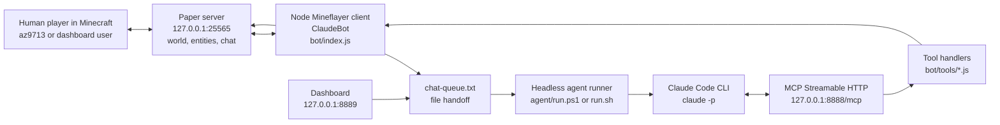

# Anatomy of the Minecraft + Claude Code Headless Agent

Date: 2026-04-27

This report explains how this project lets Claude Code appear to act inside a Minecraft world. The short version: Claude does not run inside Minecraft, and there is no custom Minecraft server plugin that embeds Claude. The project creates a normal Minecraft player account named `ClaudeBot` using Mineflayer, exposes that bot's JavaScript control surface as MCP tools, and launches `claude -p` headlessly whenever an addressed chat command arrives.


## Executive Summary

The system is a local, three-process bridge:

| Layer | Process | Main files | Job |
|---|---|---|---|
| Minecraft world | Paper server | `server/start.ps1`, `server/start.sh`, `server/server.properties` | Hosts the local Minecraft Java server on `127.0.0.1:25565`. |
| Physical avatar | Mineflayer bot | `bot/index.js` | Logs in as `ClaudeBot`, listens to game chat, moves, mines, follows, chats, and tracks shared state. |
| Tool bridge | MCP HTTP server | `bot/mcp-server.js`, `bot/tools/*.js` | Converts bot capabilities into Claude-callable tools over `http://127.0.0.1:8888/mcp`. |
| Claude loop | Headless runner | `agent/run.ps1`, `agent/run.sh`, `agent/mcp-config.json`, `agent/prompt.md` | Polls `bot/chat-queue.txt`, invokes `claude -p`, and lets Claude call the Minecraft MCP tools. |
| Optional command UI | Dashboard | `bot/dashboard.js`, `bot/public/index.html` | Shows bot status/chat and writes commands directly into the same queue. |

The "magic" is the MCP boundary. Claude Code is launched as a command-line agent with a strict MCP config pointing at the local Minecraft MCP server. Inside a Claude turn, tool names such as `get_status`, `navigate_to`, `follow_player`, `mine_block`, and `send_chat` become available. When Claude calls one, the call travels over local HTTP to Node.js, where the handler manipulates the live Mineflayer bot object.

## What "Claude Gets Into Minecraft" Really Means

Claude is not injected into the Minecraft client, the Paper server, or the JVM. It gets an embodied proxy:

1. `bot/index.js` starts a Mineflayer client using `mineflayer.createBot`.
2. That client connects to the local server at `127.0.0.1:25565`.
3. The username is fixed as `ClaudeBot`.
4. The bot uses offline auth, matching the local server's `online-mode=false`.
5. Once spawned, `ClaudeBot` is a real player entity from the server's point of view.
6. Claude Code controls that entity indirectly through MCP tools.

So the world contains `ClaudeBot`, not Claude itself. Claude "enters" by receiving a tool API attached to that bot's live game connection.

## Runtime Topology



## Launch Order and Why It Matters

The startup guide in `.ignore/START.md` describes the correct launch order:

1. Start the Paper server from `server/`.
2. Start the bot from `bot/` with `node index.js`.
3. Start the Claude runner from `agent/`.
4. Join Minecraft Java Edition `1.21.11` and connect to `127.0.0.1:25565`.

This order matters because each layer depends on the previous one:

| If this is missing | What breaks |
|---|---|
| Paper server | Mineflayer cannot connect and logs `ECONNREFUSED 127.0.0.1:25565`. |
| Mineflayer bot | MCP can start, but tools return `Bot not connected`. |
| MCP server | Claude has no live Minecraft tool bridge. |
| Runner | Chat can queue, but Claude is never invoked. |

The observed logs match this design. `bot/bot.log` shows failed reconnect attempts until the Paper server is available, then `[Bot] Spawned in world`. `server/logs/latest.log` shows `ClaudeBot joined the game`, then player chat and `ClaudeBot` replies.

## Server Layer: The Private Minecraft World

The server layer is a local Paper Minecraft server:

- Startup scripts: `server/start.ps1` and `server/start.sh`
- Jar: `server/paper-1.21.11.jar`
- Bind address: `127.0.0.1`
- Port: `25565`
- Game mode: survival
- Difficulty: peaceful
- Online authentication: disabled

The relevant settings are in `server/server.properties`:

```properties
server-ip=127.0.0.1
server-port=25565
online-mode=false
gamemode=survival
difficulty=peaceful
```

This is why both a local human player and the bot can join the same local world. It is also why `ClaudeBot` can use `auth: 'offline'` in Mineflayer.

## Bot Layer: The Minecraft Body

`bot/index.js` creates the in-world body:

```js
const BOT_NAME = 'ClaudeBot';
const SERVER_HOST = '127.0.0.1';
const SERVER_PORT = 25565;
const MC_VERSION = '1.21.11';
```

Then it logs in:

```js
const bot = mineflayer.createBot({
  host: SERVER_HOST,
  port: SERVER_PORT,
  username: BOT_NAME,
  version: MC_VERSION,
  auth: 'offline',
});
```

Mineflayer speaks the Minecraft protocol as a client. From the Paper server's perspective, `ClaudeBot` is just another player connection. The project then loads `mineflayer-pathfinder`, which gives the bot navigation primitives such as `GoalNear` and `GoalFollow`.

The bot process also starts two local services immediately:

```js
startMcpServer(state);
startDashboard(state);
```

That means `node bot/index.js` is not only the bot. It is also:

- the MCP bridge on port `8888`
- the web dashboard on port `8889`
- the chat listener
- the background action executor

## Shared State: The Live Handle Claude Eventually Touches

`bot/index.js` defines shared process-local state:

```js
const state = {
  bot: null,
  activeTask: { kind: 'idle' },
};
```

This object is passed into the MCP server and dashboard. Once the bot spawns, `state.bot` becomes the live Mineflayer bot instance. All MCP tools close over this same object. That is the main design trick: every tool handler has access to the same in-memory bot connection that is currently logged into Minecraft.

## Inbound Command Path: From Minecraft Chat to Claude

The normal in-game path is:

1. Human types a chat message in Minecraft.
2. Paper broadcasts the chat to connected clients.
3. Mineflayer receives it in `bot.on('chat', ...)`.
4. The bot ignores its own messages.
5. The bot only queues messages containing `@claude` or `@team`.
6. The addressed message is appended to `bot/chat-queue.txt`.
7. The runner sees the queue and invokes Claude Code.

The relevant logic:

```js
bot.on('chat', (username, message) => {
  if (username === BOT_NAME) {
    logBotChat(message);
    return;
  }

  const lower = message.toLowerCase();
  const isForMe = lower.includes('@claude') || lower.includes('@team');
  if (!isForMe) return;

  const entry = `${username}: ${message}\n`;
  appendFileSync(CHAT_QUEUE, entry, 'utf8');
});
```

This is intentionally simple. The chat queue is just a text file. There is no message broker, database, websocket, or persistent job system.

## Dashboard Command Path

The dashboard is parallel to in-game chat. `bot/dashboard.js` serves a UI on:

```text
http://127.0.0.1:8889
```

Its `/api/command` endpoint writes a line directly to `bot/chat-queue.txt`:

```js
const line = `Dashboard: ${message.trim()}\n`;
appendFileSync(CHAT_QUEUE, line, 'utf8');
```

This bypasses the Mineflayer `@claude` / `@team` filter. In practice, anything sent through the dashboard is handed to the runner as a Claude prompt. The prompt still tells Claude that commands should arrive as `@claude` or `@team`, but the dashboard transport itself does not enforce that rule.

## Runner Layer: Turning Queued Chat into a Claude Code Turn

`agent/run.ps1` and `agent/run.sh` implement the same loop:

1. Sleep for 500 ms.
2. Check for a busy lock file.
3. Read `bot/chat-queue.txt`.
4. If non-empty, create `agent/claude-busy.lock`.
5. Clear the queue.
6. Invoke `claude -p`.
7. Append input/output to `agent/agent.log`.
8. Remove the lock.

The PowerShell invocation is:

```powershell
$result = & claude -p `
    --strict-mcp-config `
    --mcp-config $mcpConfig `
    --append-system-prompt-file $promptFile `
    --permission-mode bypassPermissions `
    --max-turns 8 `
    $msg.Trim() 2>&1
```

The important flags:

| Flag | Meaning in this project |
|---|---|
| `-p` | Runs Claude Code in non-interactive print/headless mode for one prompt. |
| `--strict-mcp-config` | Restricts MCP availability to the supplied config. |
| `--mcp-config agent/mcp-config.json` | Points Claude at the Minecraft MCP server. |
| `--append-system-prompt-file agent/prompt.md` | Adds ClaudeBot behavior rules and tool-use patterns. |
| `--permission-mode bypassPermissions` | Lets the headless run execute without interactive permission prompts. |
| `--max-turns 8` | Caps the amount of tool-calling work per queued command. |

This makes every queued command a fresh headless Claude Code session. There is no long-lived Claude process in this implementation. Continuity mostly comes from the live Minecraft state, the bot's active task, chat context in the prompt text, and whatever Claude can read through tools in that turn.

## MCP Config: The Door Claude Uses

`agent/mcp-config.json` is minimal:

```json
{
  "mcpServers": {
    "minecraft": {
      "type": "http",
      "url": "http://127.0.0.1:8888/mcp"
    }
  }
}
```

This tells Claude Code: there is an MCP server named `minecraft`, reachable over local Streamable HTTP. When Claude starts, it can initialize that MCP session and discover the tool list exposed by `bot/mcp-server.js`.

## MCP Server Layer: Tool Surface Over the Bot

`bot/mcp-server.js` creates a Model Context Protocol server:

```js
const server = new McpServer({ name: 'minecraft', version: '1.0.0' });
registerStatusTools(server, state);
registerChatTools(server, state);
registerNavigationTools(server, state);
registerWorldTools(server, state);
registerInventoryTools(server, state);
```

It exposes `/mcp` on `127.0.0.1:8888` and tracks per-client sessions using `mcp-session-id` headers. For each new session, it creates a `StreamableHTTPServerTransport`, connects a fresh MCP server instance, and routes subsequent GET/POST/DELETE calls through that transport.

This is the actual Claude-to-Minecraft bridge. Claude Code speaks MCP. The Node process translates those MCP tool calls into Mineflayer calls.

## Tool Catalog

The available tool surface is small and concrete:

| Tool | File | What it does |
|---|---|---|
| `get_status` | `bot/tools/status.js` | Returns position, health, food, current task, and nearby players. |
| `send_chat` | `bot/tools/chat.js` | Sends a Minecraft chat message from `ClaudeBot`. |
| `navigate_to` | `bot/tools/navigation.js` | Sets a pathfinder goal near coordinates. |
| `follow_player` | `bot/tools/navigation.js` | Follows a named player with `GoalFollow`. |
| `stop_action` | `bot/tools/navigation.js` | Clears movement and returns `activeTask` to idle. |
| `rejoin_server` | `bot/tools/navigation.js` | Disconnects the bot; reconnect happens in `index.js`. |
| `mine_block` | `bot/tools/world.js` | Starts a background mining task for a block type/count. |
| `get_nearby_blocks` | `bot/tools/world.js` | Scans nearby non-air blocks and aggregates by block name. |
| `get_nearby_entities` | `bot/tools/world.js` | Lists nearby entities with names, type, distance, and position. |
| `get_inventory` | `bot/tools/inventory.js` | Lists current inventory items. |
| `collect_nearby_items` | `bot/tools/inventory.js` | Starts a background collect task for dropped item entities. |

The system prompt in `agent/prompt.md` tells Claude to call `get_status` first, parse the user's command, call the right Minecraft tool, and confirm briefly through `send_chat`.

## Outbound Action Path: From Claude Tool Call to Minecraft Movement

For a command like:

```text
@claude follow me
```

the intended chain is:

1. Runner invokes `claude -p` with the queued message.
2. Claude reads `agent/prompt.md`.
3. Claude calls `get_status`.
4. Claude decides the requested behavior is follow.
5. Claude calls `follow_player({ playerName: "az9713", range: 3 })`.
6. `bot/tools/navigation.js` sets `state.activeTask = { kind: 'follow', ... }`.
7. The tool calls `bot.pathfinder.setGoal(new GoalFollow(...), true)`.
8. Mineflayer sends movement packets to the Paper server.
9. Paper updates the `ClaudeBot` player entity in the world.
10. Claude calls `send_chat` to confirm in Minecraft chat.

That is the end-to-end illusion: a natural-language chat instruction becomes tool calls, and tool calls become player movement packets.

## Background Tasks and the 500 ms Tick Loop

Some tools return immediately while work continues in the bot process. `navigate_to`, `follow_player`, `mine_block`, and `collect_nearby_items` do not block Claude until the entire real-world action is done.

`bot/index.js` has a 500 ms tick loop:

```js
const tickInterval = setInterval(() => {
  if (!state.bot || !state.activeTask) return;
  const task = state.activeTask;

  if (task.kind === 'follow') {
    ...
  } else if (task.kind === 'mine') {
    executeMineTask(bot, task, state);
  } else if (task.kind === 'collect') {
    executeCollectTask(bot, task, state);
  }
}, 500);
```

This is why Claude can say "Mining 3 oak_log in the background." Claude starts the task; the persistent Node bot process carries it out after Claude's headless turn may already be over.

### Mining Behavior

`mine_block` does not mine directly in the MCP handler. It sets:

```js
state.activeTask = { kind: 'mine', blockName, count, range, mined: 0 };
```

The tick loop then calls `executeMineTask`, which:

1. Resolves the block name through `bot.registry.blocksByName`.
2. Finds the nearest matching block with `bot.findBlock`.
3. Walks next to it with `bot.pathfinder.goto(new GoalNear(...))`.
4. Calls `bot.dig(block)`.
5. Waits about 1.5 seconds for item pickup.
6. Repeats until `task.mined >= task.count`.
7. Chats `Done mining ...`.

This implementation can mine nearby blocks, but it does not guarantee high-level Minecraft gameplay success. For example, it does not craft tools, equip the right tool, handle unreachable blocks robustly, or explicitly drop items to the human player.

### Collect Behavior

`collect_nearby_items` scans `bot.entities` for dropped item entities and sets `activeTask` to `collect`. The tick loop walks to nearby dropped items until no item entities remain in range. It is a navigation-based pickup behavior, relying on Minecraft's normal pickup mechanics.

## Why the Bot Can Talk Back

`send_chat` is a thin wrapper:

```js
bot.chat(message);
```

That sends a normal Minecraft chat packet from `ClaudeBot`. Server logs then show messages such as:

```text
<ClaudeBot> Following you az9713!
```

This is not the Claude CLI printing to the terminal. It is the MCP `send_chat` tool making the Mineflayer client speak in-game.

## Why the Bot Can See the World

The bot sees through Mineflayer's client-side model of the world:

- `bot.entity.position` gives its current coordinates.
- `bot.players` gives visible known player records.
- `bot.entities` gives nearby entities.
- `bot.findBlocks` and `bot.blockAt` inspect loaded nearby blocks.
- `bot.inventory.items()` reports inventory.

Claude only sees these when it calls tools. Claude is not receiving pixels from the Minecraft client in this project. It is receiving structured world state through Mineflayer.

## Evidence from Current Logs

The current logs show the system working end to end:

- `server/logs/latest.log` shows the Paper server starting on `127.0.0.1:25565`.
- The same log shows `ClaudeBot joined the game`.
- `bot/bot.log` shows the bot spawning and creating MCP sessions for Claude turns.
- `agent/agent.log` shows queued inputs such as `az9713: @claude follow me` and headless Claude outputs.
- Server chat logs show `ClaudeBot` replying in Minecraft chat after Claude tool calls.

One important observation: repeated commands can create repeated Claude invocations and repeated MCP sessions. The logs show several duplicated `@claude follow me` inputs around `16:51:36`, resulting in multiple "Following you" replies. The file queue plus lock prevents simultaneous runner work, but it does not deduplicate human spam or dashboard repeats.

## The Core Illusion, Step by Step

Here is the complete path for a typical command:

| Step | Component | What happens |
|---|---|---|
| 1 | Human | Types `@claude come to -1.5 66 1.5` in Minecraft. |
| 2 | Paper | Broadcasts the chat message to connected clients. |
| 3 | Mineflayer | `ClaudeBot` receives the chat event. |
| 4 | Bot listener | Detects `@claude` and appends the line to `bot/chat-queue.txt`. |
| 5 | Runner | Reads and clears the queue, then starts `claude -p`. |
| 6 | Claude Code | Loads `agent/prompt.md` and `agent/mcp-config.json`. |
| 7 | MCP client | Connects to `http://127.0.0.1:8888/mcp`. |
| 8 | MCP server | Registers Minecraft tools over the live `state.bot` object. |
| 9 | Claude | Calls `get_status`, then `navigate_to`, then `send_chat`. |
| 10 | Tool handler | Calls Mineflayer pathfinder and chat APIs. |
| 11 | Mineflayer | Sends Minecraft protocol packets to Paper. |
| 12 | Paper | Moves the `ClaudeBot` entity and broadcasts its chat reply. |
| 13 | Human | Sees the bot move and answer in the game. |

## What Is Elegant About the Design

The design is minimal but powerful:

- It reuses a real Minecraft client library instead of writing protocol code.
- It uses MCP as the only Claude integration boundary.
- It avoids a server plugin; the Paper server can remain mostly vanilla.
- It keeps Claude stateless and on-demand through `claude -p`.
- It keeps long-running physical actions in the persistent Node process.
- It exposes a small, typed, domain-specific action space instead of giving Claude raw sockets.

The result is a good agent-demo architecture: language reasoning in Claude, embodied state/action in Mineflayer, and a thin protocol bridge between them.

## Current Limitations and Sharp Edges

### 1. Claude is not continuously thinking

Each command starts a fresh `claude -p` process. The runner does not maintain a single conversational Claude session. This is simple and robust, but it means Claude's memory is not the same thing as an always-on in-game mind.

### 2. The queue is a plain text file

`bot/chat-queue.txt` is easy to inspect and debug, but it is not a durable job queue. The runner clears the file after claiming it. If multiple messages arrive at awkward times, commands can be batched together, duplicated, or handled in a way that depends on file timing.

### 3. There is no explicit item handoff tool

The project supports mining and collecting, and the bot can follow the player. It does not currently expose a `drop_item`, `give_item`, `equip_item`, or `place_block` tool. So a request like "bring me a log" can make Claude mine and follow, but there is no direct tool that hands the item to the human.

### 4. Background tasks are coarse

`mine_block` and `collect_nearby_items` start background tasks. Claude may report intent before the physical work succeeds. The logs show cases where Claude said it had mined or brought logs, while later inventory checks were empty. This is a gap between high-level language confidence and low-level game mechanics.

### 5. Tool semantics are intentionally narrow

The bot can navigate, follow, inspect, mine, collect, rejoin, and chat. It cannot yet craft, build structures, fight, manage equipment, path plan around complex terrain at a high level, place blocks, use containers, or reason from visual screenshots.

### 6. Permission model is very permissive locally

The runner uses `--permission-mode bypassPermissions`. That is convenient for a local demo, but it is not a security posture for untrusted users or a public server.

### 7. Offline server mode is demo-friendly but insecure

The server uses `online-mode=false`, and Paper logs warn that usernames are not authenticated. This is normal for a local private demo, but it should not be exposed as a public server configuration.

## Files Worth Reading First

If you want to understand the project quickly, read in this order:

1. `.ignore/START.md` - operational launch guide.
2. `bot/index.js` - the main runtime and bot behavior.
3. `agent/run.ps1` or `agent/run.sh` - how chat becomes a headless Claude turn.
4. `agent/mcp-config.json` - how Claude finds the Minecraft MCP server.
5. `agent/prompt.md` - how Claude is instructed to behave.
6. `bot/mcp-server.js` - how the MCP server is hosted.
7. `bot/tools/*.js` - the actual actions Claude can perform.
8. `bot/dashboard.js` and `bot/public/index.html` - optional local control panel.
9. `test/smoke-test.js` - end-to-end health check.

## Suggested Next Improvements

These are the highest-leverage improvements if this project evolves beyond a demo:

| Improvement | Why it matters |
|---|---|
| Add `drop_item` / `toss_item` tool | Makes "bring me X" mechanically complete. |
| Add task completion status | Lets Claude distinguish "started mining" from "successfully mined and collected". |
| Replace text-file queue with JSONL jobs | Preserves one command per job, timestamps, IDs, retries, and dedupe. |
| Add command deduplication | Prevents repeated chat/dashboard sends from launching repeated Claude turns. |
| Add structured action results | Tools should return success/failure details Claude can trust. |
| Add `place_block` and `craft_item` tools | Enables building and survival workflows. |
| Add action timeout/cancellation | Prevents background tasks from getting stuck silently. |
| Add persistent conversation/task memory | Helps Claude remember multi-step goals across headless invocations. |
| Lock down dashboard and MCP ports | Important before any non-local use. |

## Bottom Line

Claude "gets into" the Minecraft world by controlling a Mineflayer bot through MCP. Minecraft only sees `ClaudeBot`, a normal player connection. Claude Code only sees a local MCP server with typed tools. The glue is the headless runner: it turns addressed chat into one-shot Claude Code invocations, and those invocations call tools that manipulate the live Mineflayer client.

That separation is the whole architecture:

- Minecraft provides the world.
- Mineflayer provides the body.
- MCP provides the nervous system.
- `claude -p` provides the reasoning loop.
- The queue file provides the trigger.

The project is small, but the core pattern is real: any environment that can expose state and actions as MCP tools can become an embodied world for a headless coding agent.
